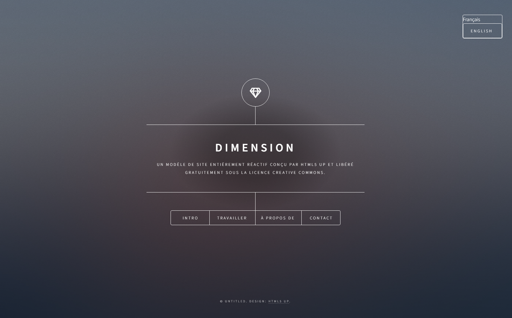
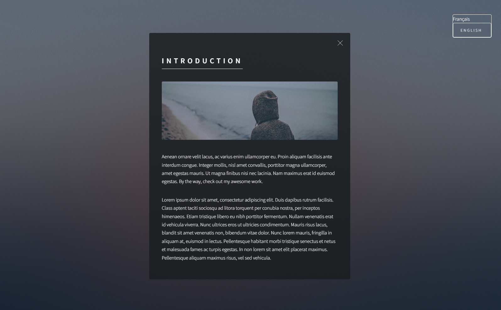
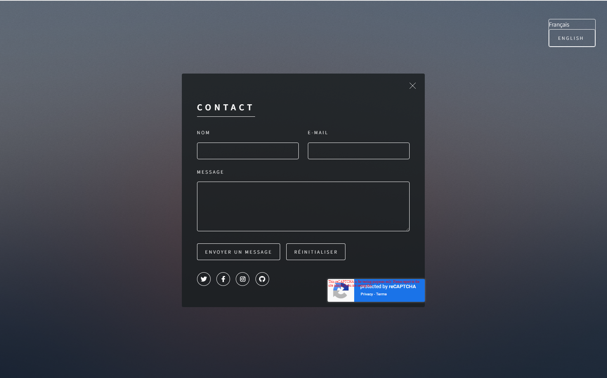

# Dimension

This project used hugo dimension theme.


A hugo port of HTML5UP's responsive and minimal dimension theme. With native support for Netlify's headless CMS.

---

- [Dimension](#dimension)
  - [How to start](#how-to-start)
  - [How to configure](#how-to-configure)
  - [Post archetype](#post-archetype)
    - [`background` and `logo` Params](#background-and-logo-params)
  - [How to run your site](#how-to-run-your-site)

## How to start

You can download this project manually by going to [https://github.com/ithunter101/hugo-theme-dimension-sample.git](https://github.com/ithunter101/hugo-theme-dimension-sample.git).

You can also clone it directly to your Hugo folder:

```
$ git clone https://github.com/ithunter101/hugo-theme-dimension-sample.git
```

## How to configure

There are english, french version in this project.
You can create blogs folder for new language in content folder.
And you need to add contentDir for new language to `config.toml` file in your Hugo root directory.

```
[languages.fr]
    ...
    contentDir = 'content/french'
```

You should replace recaptcha test key with activated key.
You can find data-sitekey placeholder in list.html(layouts/_default/list.html).
And you can change submit function for contact form.
You can find it in main.js(static/main.js). It is integrated with recaptcha.

**NOTE:** All the main page styling and configuration can be done by creating `_index.md` pages in the `content` folder and subdirectories. This choice was made to allow the use of any headless CMS (e.g. netlify) for total customization.

## Post archetype

See the basic `_index.md` file params supported by the theme — https://github.com/your-identity/hugo-theme-dimension/blob/master/archetypes/_index.md

```toml
title: Your Name
description: A great human
background: "<path or link to image>"
logo: "<path or link to image>"
```

### `background` and `logo` Params

As indicated above, `background` and `logo` can be an image of your choice by placing JPGs, PNGs, SVGs, etc. in the `static` directory of your repository. If the `static` directory does not yet exist, create it. 

## How to run your site

From your Hugo root directory run:

```
$ hugo server -t dimension
```

and go to `localhost:1313` in your browser. From now on all the changes you make will go live, so you don't need to refresh your browser every single time.

## Screenshots



